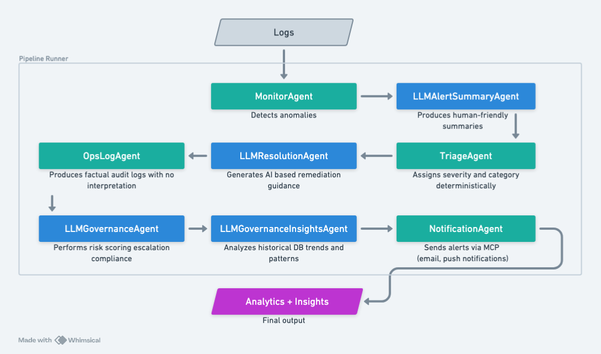

---

# 🦴 IncidentOps

### **AI-Assisted Incident Detection, Triage & Governance — Built with Kiro’s Spec-Driven Workflow**

IncidentOps is an end-to-end multi-agent incident-management system built for the **Kiro Hackathon**.
It uses **Kiro’s spec-driven development**, iterative task execution, and agent orchestration to surface recurring issues hidden inside noisy production logs.

---

## 🚀 Overview

In real operations, major failures rarely appear suddenly — they begin as *quiet, repeating signals* embedded deep in logs.

IncidentOps models this reality through an agent pipeline:

1. **MonitorAgent** – Detects anomalies in raw log entries
2. **LLMAlertSummaryAgent** – Produces human-friendly summaries
3. **TriageAgent** – Assigns deterministic severity & category
4. **LLMResolutionAgent** – Suggests remediation steps
5. **OpsLogAgent** – Writes factual audit logs
6. **LLMGovernanceAgent** – Performs risk scoring, escalation, compliance checks
7. **LLMGovernanceInsightsAgent** – Identifies long-term recurring patterns
8. **NotificationAgent** – Sends alerts externally (Pushover, Gmail for local dev)

All executed runs are persisted in a **SQLite database** and surfaced through a multi-page **Streamlit UI**.

---

## 🧩 Architecture Diagram

> **Note:** Render free tier has a 20–40s cold-start delay.



---

## 🌐 Live Deployment

### **Streamlit Application**

👉 [https://incidentops-skeleton.onrender.com](https://incidentops-skeleton.onrender.com)
*(Cold start: 20–40 seconds on free tier)*

### **MCP Server Endpoint**

👉 [https://incidentops-mcp-server.onrender.com/send](https://incidentops-mcp-server.onrender.com/send)
*(Used internally for notifications & tarot tools)*

The Streamlit app automatically connects to the MCP server using:

```
MCP_ENDPOINT
```

---

## 🖥️ How to Use the App

1. Open the deployed Streamlit instance
   *(Cold-start may take 30–60 seconds)*

2. Use the sidebar to navigate:

   * **Pipeline Runner** – Run the full agent pipeline
   * **Incident Intelligence** – View summaries and reasoning
   * **Governance** – Inspect scoring, compliance, insights
   * **Notifications** – Review outbound notification attempts
   * **Audit Logs** – Explore historical runs

3. Run the pipeline multiple times — results persist in SQLite.

---

## ⚙️ Tech Stack

| Layer         | Tool                         | Purpose                                 |
| ------------- | ---------------------------- | --------------------------------------- |
| Orchestration | Python                       | Agent logic & pipeline runner           |
| UI            | Streamlit                    | Multi-page UI                           |
| Storage       | SQLite                       | Persistent historical incident database |
| AI Reasoning  | OpenAI LLMs                  | Summaries, remediation, insights        |
| Development   | **Kiro IDE**                 | Spec-driven iterative workflow          |
| Notifications | Pushover, Gmail (local only) | External alert delivery                 |
| MCP Server    | Flask JSON-RPC               | Executes notification + utility tools   |

---

## 🧠 Kiro Capabilities Used

### **Spec-Driven Development**

Agents and workflows originated from structured specifications.

### **Start Task Workflow**

Provided deterministic, auditable generation updates.

### **Vibe Coding**

Used conversational refinement to evolve UI, DB schema, agent logic.

### **Hooks & Orchestration**

Connected governance scoring, insights extraction, and notifications.

### **Steering Documents**

Ensured consistency across UI, pipeline, DB, and agent modules.

---

## 🔌 MCP Server & Notifications

IncidentOps uses a lightweight HTTP MCP server to handle:

* **Notification tools** (Pushover, Gmail)
* **Tarot tool** (`tarot.draw`)
* Future tool integrations

### **Run MCP server locally**

```bash
python -m llm.local_mcp.server
```

Endpoints:

* `POST /send`
* `GET /health`

### **Deploy MCP server on Render**

Build command:

```bash
pip install -r requirements.txt
```

Start command (Render sets `$PORT`):

```bash
python -m llm.local_mcp.server --host 0.0.0.0 --port $PORT
```

Then set in your Streamlit service:

```
MCP_ENDPOINT=https://your-mcp-service.onrender.com/send
```

### **Important Notice for Render**

Render free tier **blocks SMTP**, meaning:

* **Gmail cannot send mail from Render.**
  (Local-only provider.)

For cloud deployment, use:

* **Pushover** (fully supported on Render)

NotificationAgent automatically uses the configured provider based on your `.env`.

---

## 📦 Local Setup

### Install dependencies

```bash
pip install -r requirements.txt
```

### Run Streamlit UI

```bash
streamlit run ui/Home.py
```

### Directory Structure (auto-created)

```
data/db/              # SQLite persistent DB
data/samples/         # Sample log files
data/output/          # Generated artifacts
logs/                 # Pipeline & MCP logs
```

---

## 🔮 Future Enhancements

* Real cloud log ingestion (CloudWatch, Prometheus, Stackdriver)
* Multi-run correlation and anomaly clustering
* Advanced risk modeling + governance heatmaps
* Integrations with Slack / Teams / PagerDuty

---

## 👤 Author

**Reema Raghava**
AI + BI + Ops Systems Architect

GitHub: [https://github.com/reema14a](https://github.com/reema14a)
LinkedIn: [https://www.linkedin.com/in/reema-raghava-28737a11/](https://www.linkedin.com/in/reema-raghava-28737a11/)

---
